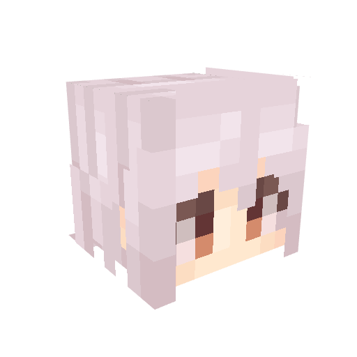

# Minecraft 皮肤渲染服务

这是一个基于 Node.js 的 Minecraft 皮肤渲染服务，可以将 Minecraft 皮肤哈希转换为 3D 渲染的头像图像，同时也支持提取皮肤的面部图像。



## 功能特点

- 高质量 3D 渲染 Minecraft 皮肤头像
- 支持自定义输出图像尺寸
- 使用 Three.js 进行 WebGL 渲染
- 支持皮肤第二层（帽子层）的透明效果
- 支持提取皮肤面部图像（16x16像素）
- RESTful API 接口方便集成

## 安装
```bash
# 克隆仓库
git clone https://github.com/bkm016/minecraft-skin-renderer.git
cd minecraft-skin-renderer

# 安装依赖
pnpm install
```

## 依赖项

- Node.js (>=14.x)
- Express
- Puppeteer
- Three.js
- node-fetch
- cors

## 使用方法

### 启动服务器

```bash
# 使用pnpm启动服务
pnpm start

# 或者直接使用Node运行
node server.js
```

服务器默认运行在`http://localhost:3001`

### API使用

#### 渲染皮肤

```
GET /render/:skinHash?width=<宽度>&height=<高度>
```

参数:
- `skinHash`: Minecraft皮肤的哈希值（从Mojang API获取）
- `width`: 输出图像宽度 (可选，默认1024，范围64-1024)
- `height`: 输出图像高度 (可选，默认1024，范围64-1024)

示例:
```
http://localhost:3001/render/ec8a66d70d571b535331e0f064831240932c180e82af2da21e522e15df5e578b?width=512&height=512
```

#### 获取面部图像

```
GET /face/:skinHash
```

参数:
- `skinHash`: Minecraft皮肤的哈希值（从Mojang API获取）

返回一个16x16像素的PNG图像，包含玩家的面部。如果皮肤有第二层（帽子层），会自动合并显示。

示例:
```
http://localhost:3001/face/ec8a66d70d571b535331e0f064831240932c180e82af2da21e522e15df5e578b
```

#### 检查服务状态

```
GET /status
```

返回服务器当前状态。

## 许可证

MIT 
